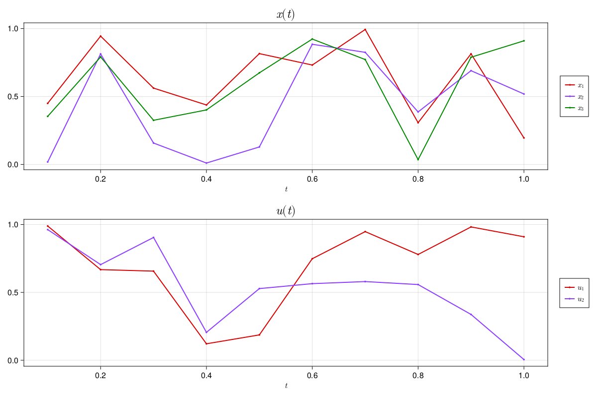

# NamedTrajectories.jl

[](https://aarontrowbridge.github.io/NamedTrajectories.jl/stable/)
[](https://aarontrowbridge.github.io/NamedTrajectories.jl/dev/)
[](https://github.com/aarontrowbridge/NamedTrajectories.jl/actions/workflows/CI.yml?query=branch%3Amain)
[](https://codecov.io/gh/aarontrowbridge/NamedTrajectories.jl)

**NamedTrajectories.jl** is a package for working with trajectories of named variables. It is designed to be used with [QuantumCollocation.jl](https://github.com/aarontrowbridge/QuantumCollocation.jl) and [QuantumIterativeLearningControl.jl](https://github.com/aarontrowbridge/QuantumIterativeLearningControl.jl).

## Notice!

This package is under active development and issues may arise -- please be patient and report any issues you find!

## Installation

NamedTrajectories.jl is now registered! Install with

```julia
using Pkg
Pkg.add(NamedTrajectories)
```


## Usage

Users can define `NamedTrajectory` types which have lots of useful functionality. For example, you can access the data by name or index.  In the case of an index, a `KnotPoint` is returned which contains the data for that timestep.

```julia
using NamedTrajectories

# define number of timesteps and timestep
T = 10
dt = 0.1

# build named tuple of components and data matrices
components = (
    x = rand(3, T),
    u = rand(2, T),
)

# build trajectory
traj = NamedTrajectory(components; timestep=dt, controls=:u)

# access data by name
traj.x # returns 3x10 matrix of x data
traj.u # returns 2x10 matrix of u data

z1 = traj[1] # returns KnotPoint with x and u data

z1.x # returns 3 element vector of x data at timestep 1
z1.u # returns 2 element vector of u data at timestep 1

traj.data # returns data as 5x10 matrix
traj.names # returns names as tuple (:x, :u)

# simple build in plotting
plot(traj)
```

This script generates the following plot as demonstrated in [demo.ipynb](examples/notebooks/demo.ipynb)



## Plotting

See plotting function in [plotting.jl](src/plotting.jl) for more details.

Documentation coming soon!

